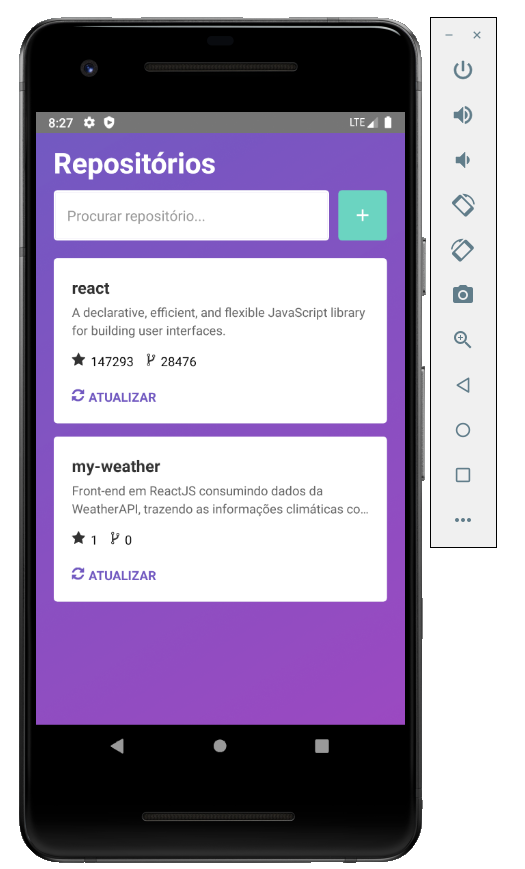

<h1 align="center">
  Repoapp
</h1>

Aplicação offline first desenvolvida como estudo do React Native com Realm DB, proposta por vídeo aula no canal da Rockatset.

## Tecnologias:
- React Native (CLI)
- Realm
- Reactotron

## Descrição:

A aplicação se propõe em um cadastro de repositórios. Esses reposítorios são buscados por seu nome completo (User/Repository) consumindo a API do Github e armazenado localmente no banco Realm, são armazenados nome completo do repositório, id, título, descrição, quantidade de estrelas e forks.

Esses repositórios são listados na tela ordenados por estrelas. O Realm implementa o <i>design pattern observer</i>, e desta forma na adição de novos repositórios, alista é atualizada automaticamente seguindo o critério de a ordenação.

Foi implementada a funcionalidade atualiza, onde o repositório que a executa é novamente procurado através da API do Github, e utilizano uma propriedade no Realm na funcionalidade de salvar denominada <i>modified</i>, é analisado se já existe um id correspondente e caso exista os dados são atualizados no banco local.

